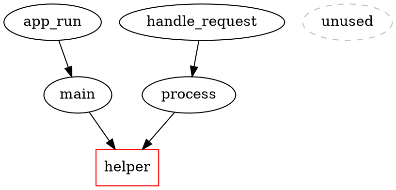

# Feature Research: Native-V2 Backend for Splice

**Domain:** Code refactoring tool with graph database backend
**Researched:** 2026-02-09
**Confidence:** HIGH

## Executive Summary

Splice has a mature proof-based refactoring system (`src/proof/`) with GraphSnapshot, RefactoringProof, and invariant validation already implemented. The native-v2 backend migration enables **new capabilities** centered around database snapshots, not basic refactoring features (which already exist).

The key insight: native-v2's snapshot system enables **safe rollback** and **impact visualization** that goes beyond the current file-level backup system. The current `--proof` flag generates a proof file, but there's no integrated snapshot-before workflow or impact graph visualization.

---

## Feature Landscape

### Table Stakes (Users Expect These)

Features that should work with native-v2 backend - parity with SQLite.

| Feature | Why Expected | Complexity | Notes |
|---------|--------------|------------|-------|
| `--snapshot-before` flag | Users expect safe rollback before any refactoring | LOW | Auto-capture DB state to `.splice/snapshots/` |
| Snapshot export/import | Ability to share and restore exact DB states | MEDIUM | JSON serialization of snapshot data |
| `verify` command | Compare snapshots to detect unintended changes | MEDIUM | Diff before/after for invariant violations |
| Backend detection (`--detect-backend`) | Users need to know which backend is active | LOW | Print "native-v2" or "sqlite" |
| Migration utility (`--migrate`) | Existing SQLite DBs must convert to native-v2 | MEDIUM | One-time conversion with backup |

**Implementation Notes:**
- Snapshot-before leverages existing `generate_snapshot()` from `src/proof/generation.rs`
- Export/import uses existing `GraphSnapshot` serialization (already JSON-compatible)
- Verify command uses existing `validate_invariants()` from `src/proof/validation.rs`

### Differentiators (Competitive Advantage)

Features ONLY possible with native-v2's optimized backend.

| Feature | Value Proposition | Complexity | Notes |
|---------|-------------------|------------|-------|
| `--impact-graph` flag | Visualize reachability impact BEFORE refactoring | HIGH | DOT/Graphviz output showing affected symbols |
| `batch` command | Multi-file refactor with coordinated proof | HIGH | Atomic cross-file operations with rollback |
| Snapshot incremental diff | Show only what changed between snapshots | MEDIUM | Efficient diff using native-v2 KV scanning |
| Hot-path analysis | Identify most-traversed execution paths | MEDIUM | Uses clustered adjacency for fast counting |
| Pub/sub watch mode | Real-time symbol tracking during refactoring | HIGH | Requires native-v2 event system |

**Why These Are Differentiators:**
- Impact graph needs fast graph traversal (native-v2's clustered adjacency)
- Batch command needs transactional snapshot isolation
- Hot-path analysis requires edge counting (expensive on SQLite)
- Watch mode needs pub/sub events (only native-v2 has this)

### Anti-Features (Commonly Requested, Often Problematic)

| Feature | Why Requested | Why Problematic | Alternative |
|---------|---------------|-----------------|-------------|
| Automatic snapshot for every edit | "Safety first" approach | Massive disk usage, slow operations | `--snapshot-before` flag (opt-in) |
| Live graph visualization in CLI | "See what's happening" | TTY complexity, dependency hell | `--impact-graph` outputs DOT for external tools |
| Snapshot versioning/branches | Git-like DB history | Complexity explosion, merge conflicts | Use git for snapshots, not version DB |
| Real-time validation during edit | "Fail fast" approach | False positives during partial edits | Validate after complete operation |

**Rationale:**
- Automatic snapshots create disk bloat (snapshots are large)
- Graph visualization in terminal is fragile (use graphviz/mermaid)
- Versioning snapshots duplicates git's purpose
- Real-time validation gives false positives during in-flight changes

---

## Feature Dependencies

```
--snapshot-before (table stakes)
    └──requires──> generate_snapshot() [EXISTS]
                   └──enhances──> verify command

verify command (table stakes)
    └──requires──> GraphSnapshot serialization [EXISTS]
                   └──requires──> validate_invariants() [EXISTS]

--impact-graph (differentiator)
    └──requires──> graph traversal algorithms [EXISTS: reachable, slice]
                   └──enhanced by──> native-v2 clustered adjacency

batch command (differentiator)
    └──requires──> --snapshot-before
                   └──requires──> verify command
                   └──requires──> transaction isolation

watch mode (differentiator, v2+)
    └──requires──> native-v2 pub/sub [NEW CAPABILITY]
```

### Dependency Notes

- **`--snapshot-before` is foundational** - both verify and batch depend on it
- **Impact graph reuses existing algorithms** - `reachable` and `slice` commands already exist
- **Batch command is the apex feature** - combines snapshot + verify + multi-file coordination
- **Watch mode is future (v2+)** - requires pub/sub infrastructure not yet exposed

---

## MVP Definition (v1 - This Milestone)

### Launch With

Minimum viable product for native-v2 support.

- [ ] **`--snapshot-before` flag** - Auto-capture DB state before any refactoring
  - Why: Enables safe rollback, foundation for all other features
  - Implementation: Call `generate_snapshot()` before edit, save to `.splice/snapshots/`

- [ ] **`verify` command** - Compare two snapshots for correctness
  - Why: Validates refactorings preserved invariants
  - Implementation: Load snapshots, run `validate_invariants()`, report violations

- [ ] **`--detect-backend` flag** - Show active backend
  - Why: Users need to know what's running under the hood
  - Implementation: Query `CodeGraph` for backend type

- [ ] **`--migrate` utility** - Convert SQLite DB to native-v2
  - Why: Existing users need migration path
  - Implementation: Read SQLite, write native-v2, verify parity

**v1 Scope:**
- Focus on safety features (snapshot + verify)
- Enable migration path
- NO impact graph, NO batch command (defer to v1.1)

### Add After Validation (v1.1)

Features to add once core snapshot workflow is validated.

- [ ] **`--impact-graph` flag** - Visualize refactoring impact
  - Trigger: Users request "show me what will break"
  - Implementation: Run `reachable` query, output DOT format

- [ ] **`batch` command** - Multi-file refactor with proof
  - Trigger: Users need coordinated renames across modules
  - Implementation: YAML spec, sequential edits with checkpoint snapshots

### Future Consideration (v2+)

Features requiring deeper native-v2 capabilities.

- [ ] **Watch mode** - Real-time symbol tracking
  - Why defer: Requires pub/sub API design and testing
  - Defer until: native-v2 pub/sub is documented and stable

- [ ] **Hot-path analysis** - Most-traversed execution paths
  - Why defer: Edge counting is expensive, needs benchmarking
  - Defer until: Performance impact is characterized

---

## Feature Prioritization Matrix

| Feature | User Value | Implementation Cost | Priority |
|---------|------------|---------------------|----------|
| `--snapshot-before` | HIGH (safety) | LOW (reuse existing) | P1 |
| `verify` command | HIGH (validation) | LOW (reuse existing) | P1 |
| `--detect-backend` | MEDIUM (debugging) | LOW (query API) | P1 |
| `--migrate` utility | MEDIUM (migration) | MEDIUM (conversion) | P1 |
| `--impact-graph` | HIGH (visibility) | MEDIUM (DOT output) | P2 |
| `batch` command | HIGH (automation) | HIGH (coordination) | P2 |
| Watch mode | MEDIUM (real-time) | HIGH (pub/sub) | P3 |
| Hot-path analysis | LOW (insight) | MEDIUM (counting) | P3 |

**Priority key:**
- **P1**: Must have for v1 launch (milestone completion)
- **P2**: Should have, add when possible (v1.1)
- **P3**: Nice to have, future consideration (v2+)

---

## CLI Interface Design

### New Flags for Existing Commands

```bash
# Add to all edit commands (rename, delete, patch, apply-files)
splice rename --symbol <id> --to <new> --snapshot-before
splice delete --file <path> --symbol <name> --snapshot-before
splice patch --file <path> --symbol <name> --with <file> --snapshot-before

# Add to all query commands
splice status --db codegraph.db --detect-backend
splice find --db codegraph.db --name "foo" --detect-backend
```

### New Commands

```bash
# Compare snapshots
splice verify --before .splice/snapshots/before-1736035200.json \
              --after .splice/snapshots/after-1736035300.json

# Migrate database
splice migrate --db codegraph.db --from sqlite --to native-v2

# Impact graph (v1.1)
splice rename --symbol <id> --to <new> --preview --impact-graph

# Batch refactor (v1.1)
splice batch --spec refactor.yaml --generate-proof
```

### Snapshot Directory Layout

```
.splice/
├── snapshots/           # NEW: database snapshots
│   ├── before-1736035200.json
│   ├── after-1736035300.json
│   └── manifest.json    # snapshot index
├── backups/             # EXISTING: file backups
│   └── rename-<id>-<timestamp>/
└── proofs/              # EXISTING: refactoring proofs
    └── rename-<timestamp>.json
```

---

## Impact Graph Visualization Design

### Output Format

```bash
splice rename --symbol "helper" --to "new_helper" --preview --impact-graph
```

### DOT Output (for graphviz)



### Human-Readable Summary

```
Impact Analysis: helper -> new_helper

Affected Symbols:
  Direct:  2 symbols call this
    - main (src/main.rs:12)
    - process (src/process.rs:45)

  Indirect:  5 symbols transitively affected
    - app_run (src/main.rs:5) -> main
    - handle_request (src/api.rs:20) -> process
    - ...

Unaffected: 12 symbols (no path to this symbol)

Recommendation: Safe to rename. No public API impact.
```

### Complexity: MEDIUM

- Reuses existing `reachable` algorithm
- DOT generation is straightforward
- Symbol metadata already available in GraphSnapshot

---

## Batch Refactor Specification

### YAML Format

```yaml
# refactor.yaml
operation: "batch_rename"
description: "Rename API module from v1 to v2"

snapshots:
  before: true   # auto-capture before snapshot
  after: true    # auto-capture after snapshot
  generate_proof: true

steps:
  - operation: rename
    symbol: "api_v1_handler"
    file: "src/api.rs"
    to: "api_v2_handler"
    verify: true

  - operation: rename
    symbol: "ApiV1Client"
    file: "src/client.rs"
    to: "ApiV2Client"
    verify: true

  - operation: apply-files
    glob: "src/**/*.rs"
    find: "API_V1_ENDPOINT"
    replace: "API_V2_ENDPOINT"
    verify: true

rollback:
  on_failure: true
  keep_snapshot: true
```

### Execution Model

1. **Pre-flight**: Validate all symbols exist, compute impact
2. **Snapshot**: Capture `before` snapshot
3. **Execute**: Apply changes sequentially
   - After each step: verify invariants
   - On failure: rollback to `before` snapshot
4. **Post-flight**: Capture `after` snapshot, generate proof

### Complexity: HIGH

- Requires transaction coordination
- Error recovery is complex
- YAML parsing and validation

---

## Competitor Feature Analysis

| Feature | ast-grep | Comby | sourmash | Our Approach |
|---------|----------|-------|----------|--------------|
| Safe rollback | Manual (git) | Manual (git) | N/A | `--snapshot-before` + DB snapshots |
| Proof generation | No | No | No | Existing proof system + verify command |
| Impact visualization | Limited | No | Yes (hash-based) | Graph traversal + DOT output |
| Multi-file refactor | Yes (scripting) | Yes (patterns) | No | Batch YAML with coordination |
| Backend abstraction | No | No | No | SQLite + native-v2 backends |

**Competitive Advantages:**
1. **Database-backed snapshots** - Exact reproducibility, not file-level
2. **Formal proof system** - SHA-256 checksums, invariant validation
3. **Graph algorithms** - Reachability, cycles, slicing built-in
4. **Dual backend** - Performance gains from native-v2

---

## Sources

| Source | Confidence | Notes |
|--------|------------|-------|
| `docs/NATIVE-V2-MIGRATION.md` | HIGH | Primary spec for native-v2 features |
| `src/proof/mod.rs` | HIGH | Existing proof infrastructure (GraphSnapshot, RefactoringProof) |
| `src/proof/generation.rs` | HIGH | `generate_snapshot()` implementation |
| `src/proof/validation.rs` | HIGH | `validate_invariants()` implementation |
| `src/proof/checksums.rs` | HIGH | SHA-256 checksum implementation |
| `src/graph/rename/mod.rs` | HIGH | Existing backup/rollback system |
| `src/cli/mod.rs` | HIGH | Current CLI interface |
| `docs/examples/proof_examples.md` | HIGH | Usage patterns for proof system |
| [sqlitegraph - Rust docs](https://docs.rs/sqlitegraph) | MEDIUM | Backend capabilities (snapshot not documented) |
| [rusqlite backup API](https://crates.io/crates/rusqlite) | LOW | SQLite backup (not native-v2) |

**Confidence Notes:**
- **HIGH confidence** on proof infrastructure (direct code inspection)
- **MEDIUM confidence** on native-v2 snapshot capabilities (migration doc exists)
- **LOW confidence** on sqlitegraph snapshot API (web search found limited docs)

**Gaps:**
- Native-v2 snapshot export/import API needs verification against sqlitegraph docs
- Pub/sub event system API not documented (need to check sqlitegraph source)
- WAL recovery behavior unclear (test needed)
